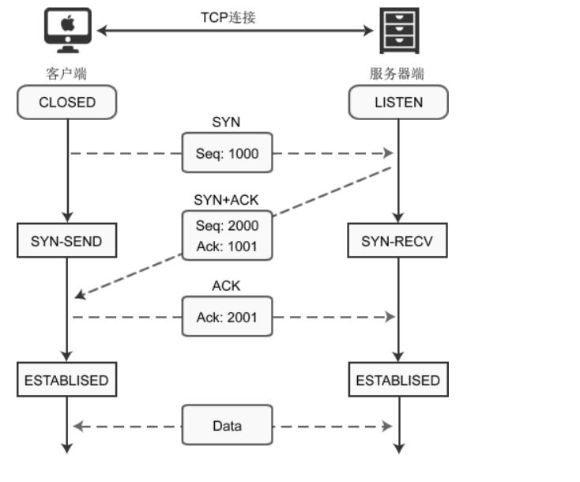
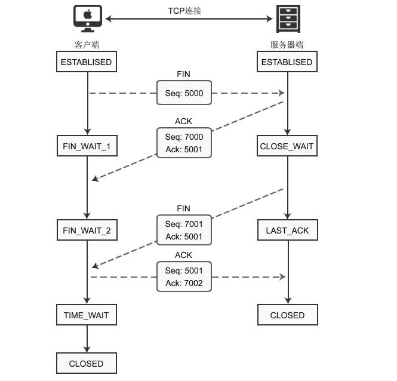
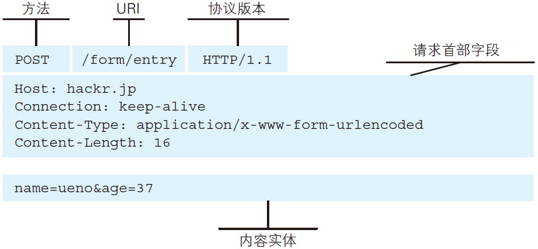
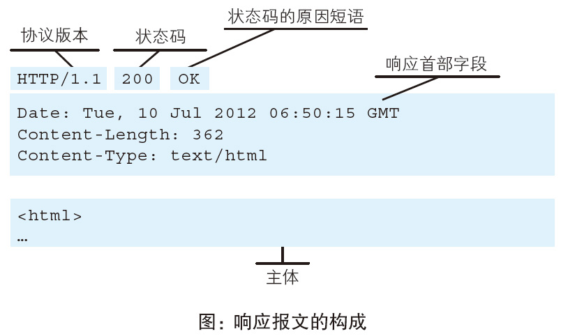
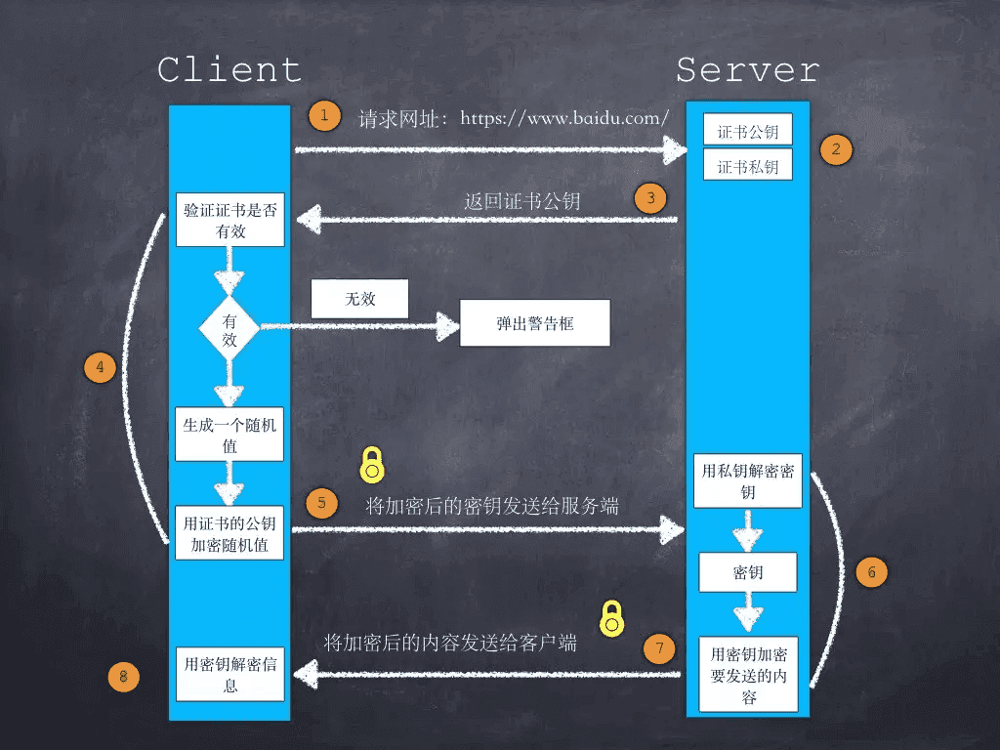

## 自我介绍、项目经历、技术栈

## SpringMVC 工作原理

1. 客户端请求提交到 DispatcherServlet
2. 由 DispatcherServlet 控制器查询一个或多个 HandlerMapping，找到处理请求的 Controller
3. DispatcherServlet 将请求提交到 Controller
4. Controller 调用业务逻辑处理后，返回 ModelAndView
5. DispatcherServlet 查询一个或多个 ViewResoler 视图解析器，找到 ModelAndView 指定的视图
6. 视图负责将结果显示到客户端

## 对 IOC、AOP 的理解

- IOC: 解决了创建一个对象时, 如何获取它所依赖的另一个对象. 即把创建和获取对象的责任交给 spring 容器
- AOP: 通过代理(或修改字节码)方式, 把非业务逻辑横切插入到业务逻辑里

## Spring 中用到了那些设计模式

TODO

## Spring Bean 的作用域和生命周期

TODO

## Spring 事务中的隔离级别

TODO

## Spring 事务中的事务传播行为

TODO

## String 为什么是不可变的？String 为啥要设计为不可变的？

TODO

## Java 多线程

一条线程指的是进程中一个单一顺序的控制流，一个进程中可以并发多个线程，每条线程并行执行不同的任务。
三种创建线程的方法：1. 通过实现 `Runnable` 接口；2. 通过继承 `Thread` 类本身；3. 通过 `Callable` 和 `Future` 创建线程。

## 悲观锁和乐观锁

- 悲观锁：在整个数据处理过程中，将数据处于锁定状态。 实现：依靠数据库提供的锁机制
- 乐观锁：乐观锁假设认为数据不会造成冲突，在数据进行提交更新时，才对数据的冲突与否进行检测。实现：记录数据版本

## volatile 和 synchronized 的区别

- 通过 volatile 修饰的变量在所有线程可见
- volatile 只能修饰变量, synchronized 可以修饰变量和方法
- 任何线程修改被 volatile 修饰的变量时会立即刷新到主内存并将其余缓存中该变量值清除, 导致其它线程只能去主内存读取最新值
- volatile 仅能实现变量的修改可见性, 而 synchronized 可以保证变量的修改可见性和原子性(锁定当前变量, 只有当前线程可以访问该变量, 其他线程被阻塞).

## 可重入锁与非可重入锁的区别

TODO ReentrantLock

## 多线程是解决什么问题的

防止阻塞, 发挥多核 CPU 优势

## 线程池解决什么问题，为什么要用线程池

避免频繁创建/销毁线程对象, 达到线程对象的重用
复用已有资源, 控制资源总量

## 线程间的几种通信方式

[参考文章](https://github.com/crossoverJie/JCSprout/blob/master/MD/concurrent/thread-communication.md)

- 等待通知机制, 两个线程通过对同一对象调用 wait() 和 notify() 方法来进行通讯
- volatile 共享内存
- CountDownLatch 并发工具
- CyclicBarrier 并发工具
- 线程响应中断
- 管道通信

## Java 提供了哪几种线程池？他们各自的使用场景是什么？

- newFixedTreadPool
- newCachedThreadPool
- newSingleThreadExecutor
- newScheduledTreadPool

## ThreadLocal

- 提供了线程的局部变量, 每个线程可以通过 `set()` `get()` 方法对局部变量操作, 但不会和其它线程局部变量冲突, 实现了线程的数据隔离
- 每个 Thread 维护一个 ThreadLocalMap 的引用, 键为 ThreadLocal 对象, 值为 `set()` `get()` 的对象
- ThreadLocal 本身并不存储值, 只是作为键让线程从 ThreadLocalMap 获取值

## HashMap 的长度为什么是 2 的幂次方

TODO

## HashMap、ConcurrentHashMap、Hashtable 的区别

- `HashMap` 不是同步的，是线程不安全，不适合应用于多线程并发环境下
- `ConcurrentHashMap` 是线程安全的，在多线程和并发环境中，通常作为 `Map` 的主要实现
- `Hashtable` 是一个遗弃的类，它把所有方法都加上 `synchronized` 关键字来实现线程安全

## ConcurrentHashMap 线程安全的具体实现方式/底层具体实现

TODO

## Object 类有哪些方法

TODO

## equals、hashCode、==

- `==` 运算符判断两个对象是不是同一个对象，即他们的地址是否相等
- `equals()` 用来判断其他的对象是否和该对象相等
- `hashCode()` 方法给对象返回一个 hashcode 值。这个方法被用于 hash tables，例如 `HashMap`

## 转发（Forward）和重定向（Redirect）的区别

转发是服务器行为.

重定向是客户端行为.
如果 web 服务器返回给客户端的 HTTP 状态码是 301(永久跳转) 或者 302(临时跳转), 则客户端浏览器就能通过响应首部字段(Response Headers) 的 Location 字段拿到重定向的 URL 进行跳转.

## TCP 三次握手和四次挥手具体过程

TCP 是基于字节流的通信协议

三次握手:

四次挥手:

## IP 地址与 MAC 地址的区别

IP 地址是指 (Internet Protocol address), 术语叫互联网协议地址, 而 MAC 地址是指 (Media Access Control Address), 直译为媒体访问控制地址, 或物理地址 (Physical Address), 每个可以连接到以太网 (Ethernet) 的设备必须有一个 MAC 地址.

参考: [知乎 - IP 地址和 MAC 地址的区别和联系是什么](https://www.zhihu.com/question/49335649)

## HTTP 请求, 响应报文格式

请求报文:

响应报文:

参考: [图解 HTTP](http://www.duokan.com/book/103506)

## 项目中的监控; 常见的监控指标

ELK 日志监控; Prometheus 业务逻辑埋点; Grafana 图形化显示监控信息.

QPS (Queries Per Second) 每秒钟处理的请求次数.

TPS (Transactions Per Second) 每秒钟处理的事务次数.

## 微服务划分的粒度

TODO

## 微服务如何保证高可用

TODO

## 微服务涉及到的技术以及需要注意的问题

TODO

## 注册中心

TODO

## 常用的负载均衡，该怎么用

TODO

## 网关能为后端服务带来哪些好处

TODO

## Spring Boot

特性:

- 方便地创建可独立运行的 Spring 应用程序
- 直接内嵌 Tomcat, Jetty 或 Undertow
- 简化了项目的构建配置
- 为 Spring 及第三方库提供自动配置
- 提供生产级特性
- 无需生成代码或进行 XML 配置

核心:

- 自动配置 Auto Configuration
- 起步依赖 Starter Dependency
- 命令行界面 Spring Boot CLI (很少用)
- Actuator (运维相关内容, 生产特性, 比如监控)

## 对 Spring Cloud 的了解

Spring Cloud 是一套微服务开发和治理框架, 包含了微服务运行的功能, 比如远程过程调用(RPC), 动态服务发现, 负载均衡, 限流等.

参考: [Spring boot 与 Spring cloud 是什么关系?](https://www.zhihu.com/question/47304987)

## Spring Bean 的生命周期

参考: [Spring 中 Bean 的生命周期是怎样的?](https://www.zhihu.com/question/38597960)

## HashMap 和 Hashtable 的区别

Hashtable 所有方法都用 `synchronized` 关键字修饰, 所以是线程安全的但是效率低, 被高版本 JDK 废弃.

HashMap 不是线程安全的.

并发情况下用 ConcurrentHashMap, 它使用了分段锁, 并发访问情况下加锁并不对所有数据锁定所以效率较高.

参考: [HashMap 和 Hashtable 的区别?](https://www.zhihu.com/question/20581065)

## Object 的 hashcode 方法重写了, 是否需要重写 equals 方法

Java 中 `a == b` 比较是否对同一个对象的引用,
`a == b` 为 true 说明 a 和 b 引用的是同一个对象.
`a.equals(b)` 为 true 说明可以认为 a 和 b 有相同的值, 但是 a b 未必引用的是同一个对象.

根据 Object 规范:

1. 如果没有修改 equals 方法中用以比较的信息, 在应用程序的一次执行过程中对一个对象重复调用
   hashCode 方法时, 它必须始终返回相同的值. 在应用程序的多次执行过程中, 每个执行过程在该
   对象上获取的结果值可以不相同.
2. 如果两个对象根据 equals(Object) 方法比较是相等的, 那么在两个对象上调用 hashCode 就必须产
   生的结果是相同的整数.

参考: <<Effective Java>>

## HashMap 线程不安全的出现场景

参考: [hashmap 的线程不安全体现在哪里?](https://www.zhihu.com/question/28516433)

## 线上 CPU 很高的解决方法, 如何找到问题

TODO

## 为什么要使用索引

索引 (Index) 是帮助 MySQL 高效获取数据的数据结构.

索引能让查询 (Query) 执行得更快.

参考: [MySQL 性能调优与架构设计](http://www.duokan.com/book/68203)

## 索引的分类

MySQL 中主要有 4 种类型的索引: B-Tree 索引, Hash 索引, Fulltext 索引, R-Tree 索引.

## 索引是如何提高查询速度的

索引多为树状结构, 在写入数据时就已经排好序, 因此查询时可以用二分查找等高效率的算法.

## 使用索引的注意事项

索引的好处:

- 提高检索效率, 降低检索过程中需要读取的数据量.
- 降低数据的排序成本.

索引的弊端:

- 索引是独立于基础数据之外的一部分数据, 因此每次更新数据都会带来额外的 IO 量和计算量.
- 索引还会带来存储空间资源的消耗

## 如何判断是否要创建索引

- 较频繁的作为查询条件的字段应该创建索引
- 唯一性太差的字段不适合单独创建索引, 即使频繁作为查询条件
- 更新非常频繁的字段不适合创建索引
- 不会出现在 WHERE 子句中的字段不该创建索引

参考: [MySQL 性能调优与架构设计](http://www.duokan.com/book/68203)

## 什么是覆盖索引

TODO

## SQL 优化的常见方法

TODO

## SQL 索引的顺序，字段的顺序

TODO

## MySQL 实现分页查询

TODO

## 有什么工具可以查看 SQL 是否用了索引

TODO

## TCP 和 UDP 的区别; TCP 传输过程中怎么做到可靠的

TODO

## 如何查找一个数组的中位数

TODO

## 反射的机制

TODO

## Object 类中的方法

TODO

## HashMap put 方法存放时如何判断是否重复

TODO

## 如果存取相同的数据, ArrayList 和 LinkedList 谁占用空间大

TODO

## Set 存的顺序是有序的吗

TODO

## Set 和 List 区别

TODO

## ArrayList, LinkedList 区别

TODO

## 常见的 Set 实现

TODO

## TreeSet 对存入的数据有什么要求, 源码实现

TODO

## HashSet 的底层实现

TODO

## HashSet 为什么不是线程安全的

TODO

## Java 中有哪些线程安全的 Map

TODO

## ConcurrentHashMap 如何做到线程安全的

TODO

## 如何保证线程安全

TODO

## synchronized 和 lock 的区别

TODO

## volatile 的原子性问题; 为什么 i++ 不支持原子性 (从计算机原理角度说明)

TODO

## happens-before 原理

TODO

## CAS 操作

CAS (Compare and Swap) 是一种高效实现线程安全的方法

- 支持原子更新操作, 适用于计数器, 序列发生器等场景
- 属于乐观锁机制
- CAS 操作失败时由开发者决定是继续尝试, 还是执行别的操作, 调用线程不会被阻塞挂起

## 公平锁, 非公平锁

TODO

## Java 读写锁

TODO

## 读写锁设计主要解决什么问题

TODO

## MySQL 分页查询语句

TODO

## MySQL 事务特性和隔离级别

TODO

## SQL having 使用场景

TODO

## 前端浏览器地址的一个 HTTP 请求到后端整个流程是怎样的

TODO

## git rebase、git merge 作用

TODO

## JDK、ClassLoader、NIO、Spring 代码熟悉程度

TODO

## Java 中的值传递和引用传递

TODO

## Integer 常量池

TODO

## Java 内存模型

TODO

## select, poll, epoll 区别

TODO

## TCP 拆包粘包

TODO

## 队列、栈、链表、树、堆、图

TODO

## 栈和队列的相同和不同之处, 栈通常采用的两种存储结构

TODO

## 两个栈实现队列, 和两个队列实现栈

TODO

## 排序都有哪几种方法? 手写快速排序, 归并排序

TODO

## 各种排序算法的时间复杂度和稳定性, 重点快排

TODO

## 单链表的遍历和逆序

TODO

## 深度优先搜索和广度优先搜索

TODO

## 最小生成树

TODO

## 常见 Hash 算法, 哈希的原理和代价

TODO

## 全排列, 贪心算法, KMP 算法, hash 算法

TODO

## 一致性 Hash 算法

TODO

## GET 和 POST 的区别

TODO

## HTTP 请求和响应的全过程

TODO

## OSI 七层模型

TODO

## TCP/IP 四层模型及原理

TODO

## 容量控制, 拥塞控制

TODO

## 子网划分

TODO

## IPV4 和 IPV6

TODO

## HTTP, HTTPS 和 HTTP/2

SSL (Security Sockets Layer 安全套接层):

- 为网络通信提供安全及数据完整性的一种安全协议.
- 是操作系统对外的 API, SSL3.0 后更名为 TLS
- 采用身份验证和数据加密保证网络通信的安全和数据完整性

HTTPS 数据传输流程:

版本 1:

- 浏览器将支持的加密算法信息发送给服务器
- 服务器选择一套浏览器支持的加密算法, 以证书的形式回发浏览器
- 浏览器验证证书合法性, 并结合证书公钥加密信息发送给服务器
- 服务器使用私钥解密信息, 验证哈希, 加密响应消息回发浏览器
- 浏览器解密响应消息, 并对消息进行验真, 之后进行加密交互数据

版本 2:

- 客户端请求服务器获取证书公钥
- 客户端 (SSL/TLS) 解析证书（无效会弹出警告）
- 生成随机值
- 用公钥加密随机值生成密钥
- 客户端将秘钥发送给服务器
- 服务端用私钥解密秘钥得到随机值
- 将信息和随机值混合在一起进行对称加密
- 将加密的内容发送给客户端
- 客户端用秘钥解密信息

HTTP 和 HTTPS 的区别:

- HTTPS 需要到 CA 申请证书, HTTP 不需要
- HTTPS 密文传输, HTTP 明文传输
- 连接方式不同, HTTPS 默认使用 443 端口, HTTP 使用 80 端口
- HTTPS = HTTP + 加密 + 认证 + 完整性保护, 较 HTTP 安全

参考:

- [HTTPS 加密过程详解](https://segmentfault.com/a/1190000019976390)
- [深入浅出：HTTP/2](https://www.cnblogs.com/confach/p/10141273.html)
- [一文读懂 HTTP/1HTTP/2HTTP/3](https://zhuanlan.zhihu.com/p/102561034)

## 加密的方式

- 对称加密: 加密和解密都使用同一个秘钥
- 非对称加密: 加密使用的秘钥和解密使用的秘钥是不相同的
- 哈希算法: 将任意长度的信息转换为固定长度的值, 算法不可逆
- 数字签名: 证明某个消息或者文件是某人发出/认同的

## 数据库范式

TODO

## 数据库事务和隔离级别

TODO

## 为什么需要锁, 锁定分类, 锁粒度

TODO

## 乐观锁, 悲观锁的概念及实现方式

TODO

## 分页如何实现

TODO

## MySQL 引擎

MySQL 常用存储引擎有: InnoDB, MyISAM

MyISAM:

- 只支持表级锁

InnoDB:

- 支持事务, 是 MySQL 最流行的存储引擎
- 通过行锁机制实现索引
- 实现外键

## MySQL 语句优化

TODO

## 从一张大表读取数据, 如何解决性能问题

TODO

## 内连接, 左连接, 右连接作用及区别

TODO

## 什么是数据库连接池

TODO

## Java 中实现多态的机制是什么, 动态多态和静态多态的区别

TODO

## 接口和抽象类的区别, 如何选择

TODO

## Java 能不能多继承, 可不可以多实现

TODO

## Static Nested Class 和 Inner Class 的不同

TODO

## 重载和重写的区别

TODO

## 是否可以继承 String 类

TODO

## 构造器是否可被 override

TODO

## public, protected, private 的区别

TODO

## 列举几个 Java 中 Collection 类库中的常用类

TODO

## List, Set, Map 是否都继承自 Collection 接口? 存储特点分别是什么?

TODO

## ArrayList, LinkedList, Vector 之间的区别与联系

TODO

## HashMap, Hashtable, TreeMap, ConcurrentHashMap 的区别

TODO

## Collection 和 Collections 的区别

TODO

## 其他的集合类: TreeSet, LinkedHashMap 等

TODO

## Error 和 Exception 的区别

TODO

## 异常的类型, 什么是运行时异常

TODO

## 列举 3 个以上的 RuntimeException

TODO

## Java 中的异常处理机制的简单原理和应用

TODO

## String, StringBuffer, StringBuilder 的区别

TODO

## Input/OutputStream 和 Reader/Writer 有什么区别?

TODO

## 如何在字符流和字节流之间转换?

TODO

## switch 可以使用那些数据类型

TODO

## Java 的四种引用

TODO

## 序列化与反序列化

TODO

## 正则表达式

TODO

## int 和 Integer 的区别, 什么是自动装箱和自动拆箱

TODO

## 进程和线程的区别

TODO

## 并行和并发的区别和联系

TODO

## 同步与异步

TODO

## 多线程的实现方式, 有什么区别

TODO

## 什么叫守护线程

TODO

## 如何停止一个线程?

TODO

## 什么是线程安全

TODO

## synchronized 和 lock 的区别

TODO

## 当一个线程进入一个对象的一个 synchronized 方法后, 其它线程是否可进入此对象的其它方法?

TODO

## 启动一个线程是用 run() 还是 start()?

调用 start() 方法会创建一个新的子线程并启动, run() 方法只是 Thread 的一个普通方法调用.

## wait 和 sleep 的区别

TODO

## notify 和 notifyAll 的区别

TODO

## 线程池的作用

TODO

## Java 中线程池相关的类

TODO

## GC 的概念, 如果 A 和 B 对象循环引用, 是否可以被 GC?

TODO

## JVM GC 如何判断对象是否需要回收, 有哪几种方式?

TODO

## Java 中能不能主动触发 GC

TODO

## JVM 的内存结构, 堆和栈的区别

TODO

## JVM 堆的分代

TODO

## Java 中的内存溢出是什么, 和内存泄露有什么关系

TODO

## Java 的类加载机制, 什么是双亲委派

TODO

## ClassLoader 的类加载方式

TODO

## NIO, AIO 和 BIO 之间的区别

TODO

## IO 和 NIO 常用用法

TODO

## hashcode 有哪些算法

TODO

## 反射的基本概念，反射是否可以调用私有方法

TODO

## Java 中范型的概念

TODO

## JVM 启动参数，-Xms 和 -Xmx

TODO

## 代理机制的实现

TODO

## `String s = new String("s")` 创建了几个对象

TODO

## web.xml 中常用配置及作用

TODO

## 什么是 MVC

TODO

## session 和 cookie 的区别

TODO

## HTTP 请求中 session 实现原理?

TODO

## 如果客户端禁止 Cookie 能实现 Session 吗?

TODO

## 常见的 web 请求返回的状态码

TODO

## Spring 的事务管理, Spring Bean 注入的几种方式

TODO

## Spring Bean 的初始化过程

TODO

## Spring 四种依赖注入方式

TODO

## 什么是 web 服务器, 什么是应用服务器, 常用的 web 服务器有哪些

TODO

## 什么是 SQL 注入, XSS 攻击, CSRF 攻击, 如何避免

TODO

## Java 的动态代理的概念, 实现

TODO

## XML 的解析方式, 以及优缺点

TODO

## Ajax 如何解决跨域问题

TODO

## 列举常见的设计模式

TODO

## 单例 (Singleton) 的几种实现方式, 实现一个线程安全的单例

TODO

## 工厂模式和抽象工厂模式之间的区别

TODO

## 请简单介绍一下你的这个项目, 以及在项目中充当什么角色, 这个项目的技术选型有做过么

TODO

## 选择某项技术做过哪些调研和对比

TODO

## 这个项目中遇到的最大的问题是什么? 你是如何解决的?

TODO

## 项目中是否考虑过性能, 安全性等问题

TODO
