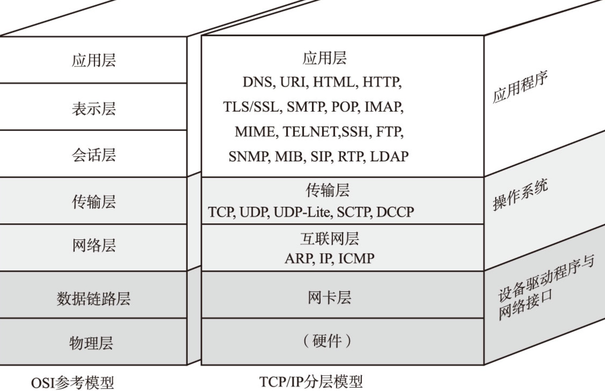

- << 图解TCP/IP(第五版) >>
- << TCP/IP经典入门(第五版) >>

# 0. TCP 概述
- 面向连接 (connection-oriented)
- 可靠的 (reliable)
  - 检验和
  - 包的序列号解决乱序、重复
  - 超时重传
  - 流量控制、拥塞控制
- 基于字节流 (byte-stream)
- 全双工 (full-duplex)

# 1. OSI 参考模型
层数|分层名称|功能
-|-|-
7|应用层|为应用程序提供服务并规定应用程序中通信相关的细节，电子邮件->电子邮件协议。
6|表示层|设备固有数据格式和网络标准数据格式的转换，管理数据加密与压缩。
5|会话层|通信管理，负责建立和断开通信连接。管理传输层以下的分层。在计算机的通信应用之间建立会话。
4|传输层|管理两个节点之间的数据传输，确保数据被可靠地传送到目标地址。为网络提供错误控制和数据流控制。 
3|网络层|地址管理与路由选择。
2|数据链路层|互联设备之间传送和识别数据帧。将“0”、“1”序列划分为具有意义的数据帧传送给对方端。提供与网络适配器相连的接口，维护子网的逻辑链接。
1|物理层|负责“0”、“1”比特流（“0”、“1”序列）与电压的高低、光的闪灭之间的互换。界定连接器和网线的规格。把数据转换为传输介质上的电子流或模拟脉冲，并监视数据的传输。

# 2. TCP/IP 协议分层模型
层数|分层名称|功能
-|-|-
4|应用层|
3|传输层|为网络提供了流量控制、错误控制和确认服务，充当网络应用程序的接口。
2|互联网层/网际层|提供独立于硬件的逻辑寻址，让数据能在具有不同物理结构的子网之间传递。
1|网卡层/网络访问层|提供了与物理网络连接的接口。针对传输介质设置数据的格式，根据硬件的物理地址实现数据的寻址，对数据在物理网络中的传递提供错误控制。
0|硬件|

# 3. OSI 参考模型与 TCP/IP 的关系

OSI 参考模型注重“通信协议必要的功能是什么”，TCP/IP 更强调“在计算机上实现协议应该开发哪种程序”。

# 4. 三次握手四次挥手
次数|客户端|方向|服务端
-|-|:-:|-
1|SYN|->|
2||<-|SYN + ACK
3|ACK|->|
4|FIN|->|
5||<-|ACK
6||<-|FIN
7|ACK|->|
