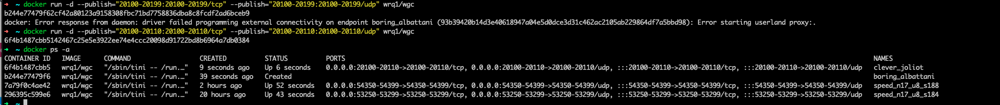
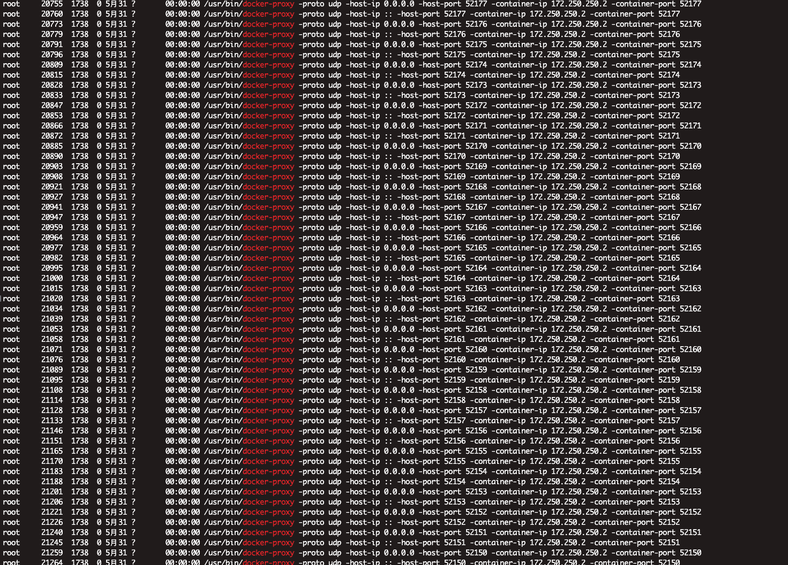
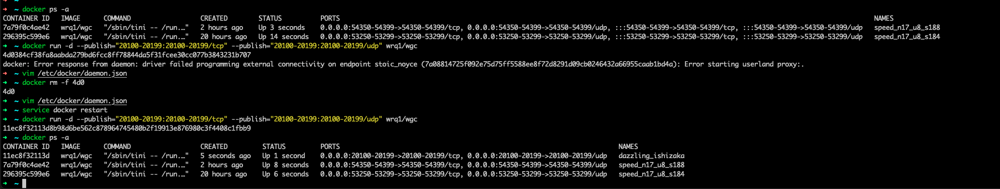

## 问题复现

只使用 10 个端口时候可以启动容器成功, 当使用 100 个端口时候就启动失败..

## 问题原因猜测

docker 实现宿主机到容器的端口转发, 默认情况下, 是为每个端口启动一个 docker-proxy 进程来转发宿主机流量到容器对应的端口.

当需要转发的端口数量很多时候, 非常占用系统资源, 并且导致启动容器非常慢.

## 解决方法

docker 守护进程禁用 docker-proxy 转发端口流量, 使用宿主机 iptable 转发.

1. 修改 /etc/docker/daemon.json: `{"userland-proxy": false}`
2. 重启 docker 守护进程: `service docker restart`. 在部署和升级时候, 同样需要禁用 docker-proxy..

禁用 docker-proxy 后使用可以使用 100 个端口正常启动容器, 并 `ps -ef` 不再有一堆 docker-proxy 进程.

## 参考文章

1. https://stackoverflow.com/questions/37770567/why-does-docker-run-so-many-processes-to-map-ports-though-to-my-application
2. https://windsock.io/the-docker-proxy/
3. https://github.com/moby/moby/issues/14856
4. https://www.cnblogs.com/xiaojikuaipao/p/5634020.html
